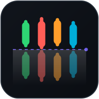

<p align="center">
  
</p>

<h1 align="center">mirage</h1>

<p align="center">
  <a href="#"></a>
  <a href="#"></a>
  <a href="#"></a>
  <a href="#"></a>
  <a href="#"></a>
  <a href="#"></a>
</p>

<p align="center">
  <sub>codename — easily renamed in <code>go.mod</code> / README</sub>
</p>

<p align="center">
  <b>A configurable crypto-exchange emulator with a real matching engine.</b><br>
  Mirrors live Coinbase / Binance markets in real time, speaks <b>Binance- and
  Coinbase-compatible APIs</b>, and is built to be a <b>test bed for trading & OMS
  systems</b> — deterministic, scriptable, and adversarial on demand.
</p>

---

> **Runnable today.** `EXCHANGE_CONFIG=configs/dev.yaml go run ./cmd/exchange` boots a live
> Coinbase-mirroring exchange you can trade against. Done & reviewed: live feed → reference book →
> seeding → return-to-reference → trade replay → toxicity, exact fixed-point pricing, **Binance-
> and Coinbase-compatible REST + WebSocket APIs**, fault injection (price-shift / latency /
> scripted scenarios), metrics + rate limiting, full trace replay (+ speed pacing), a cross-venue
> arb harness, a **CCXT-go conformance pass** (a stock client drives the edge with only a base-URL
> change), and a **testnet custody/faucet toolkit** (XLM/SOL/ETH/ERC20/USDC/BTC, encrypted at
> rest). Remaining (tail): scenario golden-file CI tests, gRPC/WS request metrics. Progress in
> [STATUS.md](STATUS.md), checklist in [TODO.md](TODO.md), design in [PLAN.md](PLAN.md).

## Why

You want to test an OMS or a trading strategy against something that behaves like a real
venue — without paying for one, without rate limits, and **with the ability to reproduce a
scenario exactly**. `mirage` anchors an internal limit order book to a **reference book**
rebuilt live from a real exchange feed, runs a genuine price-time matching engine on top,
and lets you bend reality with config: inject latency, shift prices, replay a recorded
session, or crank up market toxicity.

## What's Inside

### The two core mechanisms

| | Mechanism | What it does |
|---|-----------|--------------|
| **[a]** | **Return-to-Reference (RTR)** | After your order perturbs the book, the emulator *progressively converges* the local LOB back toward the live feed — draining stale synthetic liquidity first, then tracking the spot as it moves. Convergence speed is a knob (`tau`). |
| **[b]** | **Configurable toxicity** | Resting limit orders get adversely selected per a tunable parameter, driven by **tape-induced models** — **Kyle's λ** (price impact) and **VPIN** (informed-trading proxy) — with **over/under-weight knobs** (`scale: 0` = off). |

### Test-bed controls

Purpose-built for technical and scenario testing of trading / OMS systems:

| Control | Use |
|---------|-----|
| **Record & replay** | Record any live Coinbase/Binance session to a trace, then replay it deterministically (real-time or accelerated `speed`) — the basis for repeatable unit/scenario tests. |
| **Artificial latency** | Inject delays (feed→book, order ack, fill report; per-API-edge). Either a **fixed** extra delay or a **stochastic** one — uniform jitter, or a **shifted-Poisson** (fixed base + Poisson-distributed tail). |
| **Fault & scenario injection** | A JSONL timeline mutates the fault knobs on cue mid-run (price shift, latency, toxicity) — basic chaos engineering for an OMS under test. |
| **Artificial price shift** | Offset / scale the reference price per venue to manufacture **cross-venue dislocations** — a controlled lab for **arbitrage** and relative-value models (see the cross-venue arb harness). |
| **Seedable determinism** | Matching uses an injectable clock; RTR + toxicity + latency use a seeded RNG, so a scenario reproduces **bit-for-bit** (asserted by golden tests). |

### API surface

| Surface | Shape | Status |
|---------|-------|--------|
| **Binance-compatible** | REST `/api/v3/*` (order, depth, ticker, openOrders, account, withdraw) + WS (`@trade`, `@depth20` snapshot **& `@depth` incremental diffs** with `lastUpdateId` sync, user-data `executionReport` via listenKey) + HMAC-SHA256 signing | ✅ done |
| **Coinbase-compatible** | Advanced Trade REST (orders, batch_cancel, product_book, products, accounts, withdraw; **fee fields** + `price_increment`) + WS (`level2` **true incremental diffs**, `market_trades`, `user`) + CB-ACCESS HMAC **& ES256 JWT** (CCXT-go conformance pass) | ✅ done |
| **Native** | gRPC bidi-stream, HTTP REST, WebSocket | ✅ done |

> Prices & quantities are exact **base-10 fixed-point decimals** (`pkg/decimal`, 18 digits,
> 128-bit) end-to-end — matching is bit-deterministic, venue decimal strings round-trip losslessly.

> API compatibility ships a **documented subset**, not 100% parity — enough to point an
> existing client/bot at the emulator.

### Live data feeds

Real-time order books and trades, vendored & normalized from the
[`this-is-not-bbg`](../this-is-not-bbg) adapters:

| Venue | Streams |
|-------|---------|
| **Binance** | `@depth20@100ms` (book), `@trade` |
| **Coinbase** | `market_trades`, `level2` (book) |
| **Replay** | file-backed source — recorded traces, fully deterministic |

### Custody examples (stretch, testnet only)

Optional, off by default: a testnet wallet/faucet + on-chain **send & deposit-watch** toolkit on
**XLM** (Horizon), **Solana** (devnet, SOL + USDC SPL), **EVM/ERC20** (Sepolia, ETH + USDC/USDT),
and **BTC** (testnet). Keys are AES-256-GCM + Argon2id encrypted at rest (passphrase via env),
testnet-only-guarded, never mainnet. An optional **transfer hub** rebalances inventory between the
two venue ledgers: a withdrawal debits one venue, sends a real testnet tx from its custody hot
wallet, and a deposit watcher auto-credits the destination (XLM live-verified; EVM/SOL/BTC signing
vector-verified, live broadcast faucet-gated). **USDC auto-credit** works on XLM/EVM/Solana.

## Architecture

```
  Real venue WS ─► feed/ (Binance, Coinbase, replay — normalized)
                     │  reference LOB + real trade tape
                     ▼
                 emulator/ ── Seeder ──► mirror reference as synthetic liquidity
                     │  ├─ [a] RTR controller     (converge book → reference)
                     │  ├─ [b] toxicity model     (Kyle λ / VPIN adverse-select)
                     │  ├─ replay + clock          (real-time / accelerated)
                     │  └─ fault injection         (latency · price-shift)
                     ▼
              internal/engine + internal/orderbook   (real price-time matching)
                     ▼
        api/binance · api/coinbase · native gRPC/HTTP/WS · custody/ (optional)
                     ▲
              your OMS / trading strategy under test
```

## Quick Start

```bash
# build + full local CI gate (gofmt, vet, lint, build, race tests)
make ci

# run the emulator (mirrors live Coinbase by default; see configs/dev.yaml)
EXCHANGE_CONFIG=configs/dev.yaml go run ./cmd/exchange
#   gRPC :50051 · HTTP(S) :8080 · WS :8081 · metrics :9090
#   (enable api.binance :8082 / api.coinbase :8083 in the config)

# read a book over the native HTTP API (dev TLS + token):
curl -sk -H "Authorization: Bearer dev-secret-token" https://localhost:8080/snapshot/BTC-USD

# scrape metrics:
curl -s http://localhost:9090/metrics

# inspect a live or recorded feed directly:
go run ./cmd/feedcat -venue coinbase -symbols BTC-USD
```

With `api.binance.enabled: true`, a stock Binance client works with only its base URL changed —
e.g. a signed order:

```bash
Q="symbol=BTCUSDT&side=BUY&type=LIMIT&timeInForce=GTC&quantity=1&price=50000&timestamp=$(($(date +%s)*1000))"
SIG=$(printf '%s' "$Q" | openssl dgst -sha256 -hmac "$SECRET" | sed 's/^.* //')
curl -sk -H "X-MBX-APIKEY: $KEY" -X POST "https://localhost:8082/api/v3/order?$Q&signature=$SIG"
```

> CI is a **local `./ci.sh`** script (not GitHub Actions). Run it before every commit.
> Set `emulator.enabled: false` to run as a plain offline matching engine.

### OMS / trading-engine integration tests

For pointing an external OMS or trading engine at the Binance edge in automated tests, boot
the ready-made preset verbatim — **plain HTTP** on a fixed port `:8192`, seeded balances,
`BTCUSDT ↔ BTC-USD`, and `emulator.enabled: false` for a deterministic plain matching engine
(no live feed, no synthetic liquidity):

```bash
EXCHANGE_CONFIG=configs/oms-test.yaml go run ./cmd/exchange
# Binance edge: http://localhost:8192  (test creds: X-MBX-APIKEY "k", HMAC secret "s")
```

The edge serves the signed order lifecycle a consumer needs: **POST** `/api/v3/order`
(place — **idempotent on `newClientOrderId`**: a duplicate id is rejected `-2010` "Duplicate
order sent." and never creates a second resting order, like real Binance), **GET**
`/api/v3/order` (query one order by `orderId` or `origClientOrderId` → current
status/`executedQty`/`cummulativeQuoteQty`), **DELETE** `/api/v3/order` (cancel by either
key), and **GET** `/api/v3/openOrders`. See TESTING.md §7 for a boot-and-drive smoke.

## Configuration

Behavior is config-driven — retune without recompiling (`configs/dev.yaml`):

```yaml
emulator:
  enabled: true
  venue: coinbase            # coinbase | binance
  instruments: ["BTC-USD", "ETH-USD"]
  rtr:        { tau_ms: 3000, drain_stale_first: true }   # [a]
  toxicity:   { scale: 1.0, kyle_weight: 1.0, vpin_weight: 1.0, window_trades: 500, seed: 42 }   # [b]
  replay:     { mode: live, file: "", speed: 1.0 }        # live | file (trace replay)
  latency:    { feed_to_book_ms: 0, order_ack_ms: 0, fill_report_ms: 0, jitter_ms: 0 }
  price_shift: { offset_bps: 0, scale: 1.0 }              # manufacture cross-venue arb
  scenario:   { file: "", speed: 1.0 }                   # scripted JSONL timeline of injections
metrics:
  enabled: true
  listen: ":9090"                                        # GET /metrics (Prometheus text)
api:
  binance:  { enabled: false, listen: ":8082", api_key: "", secret: "", rate_per_sec: 20, burst: 40 }
  coinbase: { enabled: false, listen: ":8083", api_key: "", secret: "", rate_per_sec: 20, burst: 40 }
```

A **scenario** is a JSONL timeline that drives the fault injectors on cue (the OMS-test-bed core):

```
# open a +15bp cross-venue dislocation, add 50ms feed latency at t=5s, close at t=10s
{"at_ms": 0,     "action": "price_shift", "params": {"offset_bps": 15}}
{"at_ms": 5000,  "action": "latency",     "params": {"feed_to_book_ms": 50, "jitter_ms": 10}}
{"at_ms": 10000, "action": "price_shift", "params": {"offset_bps": 0}}
```

## Repository Layout

```
cmd/exchange/        runnable node (matching engine + API servers)
cmd/feedcat/         feed inspector (Phase 1)
internal/engine/     order validation + routing
internal/orderbook/  price-time matching, per-instrument books
internal/feed/        vendored Binance/Coinbase WS adapters + replay (Phase 1)
internal/reference/  live reference book (Phase 2)
internal/emulator/   seeder · RTR · tape replay · toxicity injector · fault injection · scenarios
internal/toxicity/   Kyle λ + VPIN estimators
internal/api/        gRPC / HTTP / WS native + binance/ (REST+WS) + coinbase/ (REST+WS) adapters
internal/metrics/    dependency-free Prometheus-text registry
internal/ratelimit/  token-bucket + keyed rate limiter
internal/margin/     risk validation (stub)
pkg/decimal/         exact base-10 fixed-point (prices & quantities)
pkg/{wal,config,auth} durability, config (+ Validate), token auth
proto/exchange/v1/   gRPC service definitions
```

## Non-Goals

- A production exchange (settlement finality, full regulatory surface).
- Mainnet custody / real funds.
- 100% API coverage of either venue.

## License

TBD.

---

<p align="center"><sub>Built as a deterministic, adversarial sandbox for trading & OMS development.</sub></p>
